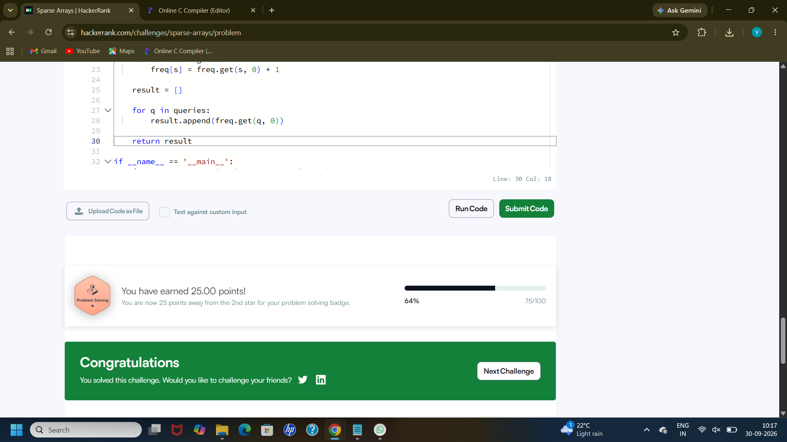

# HackerRank 3rd Semester Portfolio

## HackerRank Algorithmic Problem-Solving & Portfolio Integration

This repository contains my solutions for the HackerRank Algorithmic Problem-Solving activity. All five mandatory problems were solved using Python and organized into separate folders.

## HackerRank Profile

**Public HackerRank Profile:**  
https://www.hackerrank.com/profile/vijayalakshmi284

## Problems Completed

| Problem | Language | Time Complexity | Space Complexity | Status |
|---|---|---|---|---|
| Diagonal Difference | Python | O(N) | O(1) | Accepted |
| Dynamic Array | Python | O(N + Q) | O(N) | Accepted |
| Time Conversion | Python | O(1) | O(1) | Accepted |
| Compare the Triplets | Python | O(1) | O(1) | Accepted |
| Sparse Arrays | Python | O(N + Q) | O(N) | Accepted |

## Problem Solutions

### 1. Diagonal Difference
[View Solution](01-diagonal-difference/diagonal_difference.py)

### 2. Dynamic Array
[View Solution](02-dynamic-array/dynamic_array.py)

### 3. Time Conversion
[View Solution](03-time-conversion/time_conversion.py)

### 4. Compare the Triplets
[View Solution](04-compare-triplets/compare_triplets.py)

### 5. Sparse Arrays
[View Solution](05-sparse-arrays/sparse_arrays.py)

## Accepted Submission Screenshots

### Diagonal Difference

### Dynamic Array

### Time Conversion

### Compare the Triplets

### Sparse Arrays

## HackerRank Badge

I achieved the **3-Star Problem Solving badge** on HackerRank.

## Algorithmic Optimization Techniques

During this activity, I learned how to analyze algorithms using time and space complexity. I practiced selecting appropriate approaches based on the input size and problem requirements. I used direct traversal for problems such as Diagonal Difference and Compare the Triplets, while Dynamic Array and Sparse Arrays required efficient data structures to store and retrieve values. I also learned that reducing unnecessary operations can improve the efficiency of a solution. Understanding Big-O notation helped me identify the expected growth of running time and memory usage. Solving these problems in Python also improved my ability to translate algorithms into clean and readable code.

## Conclusion

This portfolio demonstrates my progress in algorithmic problem-solving, complexity analysis, Python programming, and GitHub-based documentation.
